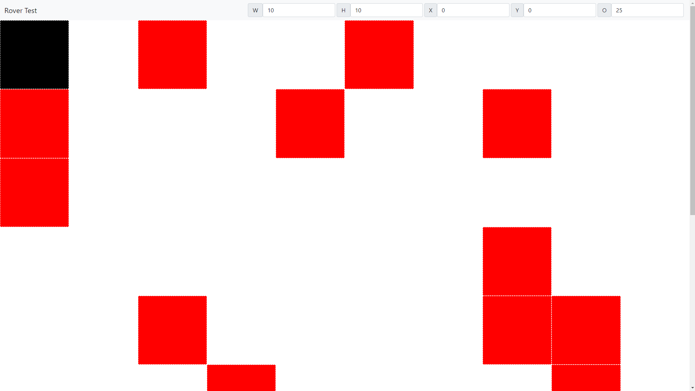
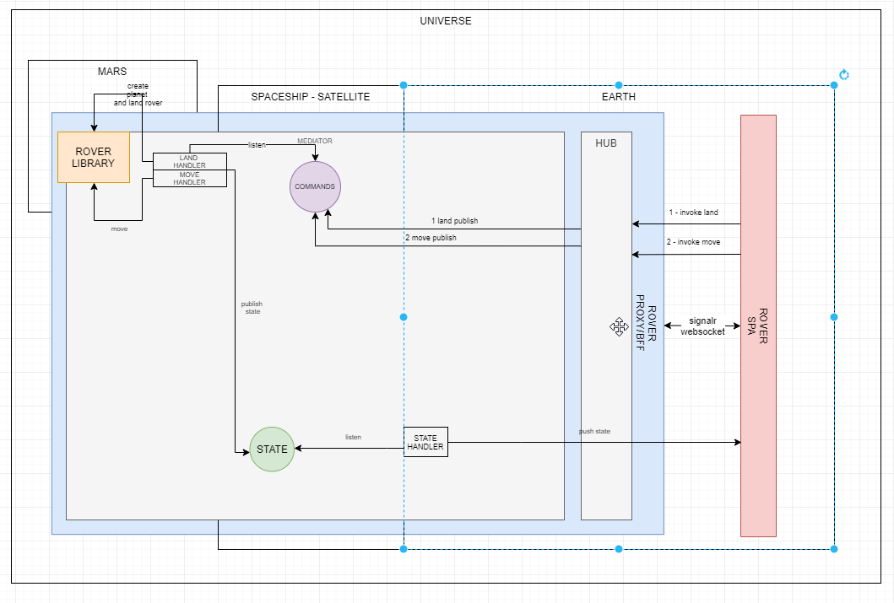
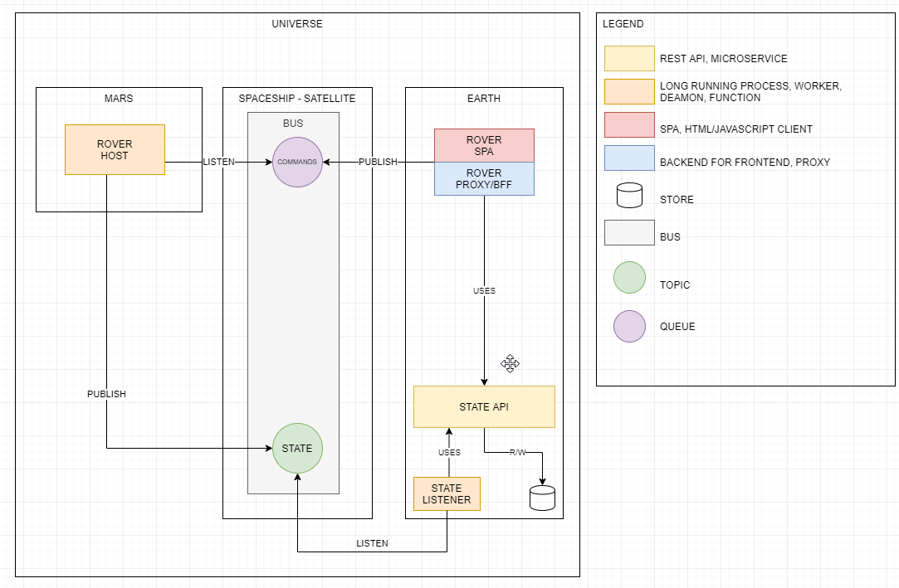

# Perseverance POC

## 05 - Demo

 - [Demo](https://perseverance.azurewebsites.net/)


 - the black box is the rover
 - the red boxes are the obstacles
 - the top bar exposes
   - width of the planet (max 255 not checked)
   - height of the planet
   - position of the rover (x/y)
   - number of obstacles (the position of the obstacles are randomized)
   - the ui should be reactive and restart at each change (no throttle logic have been implemented)
 - to move the rover use arrows (focus the tab before)
 - no buffer has been implemented in the client so each key press trigger moves.
 - event.KeyCode has been deprecated in favor of a strange literal enum. I translated in the SPA the string of the key pressed in the original "F" "B" "R" "L" char codes selected at the beginning.
 - during the interaction I noticed a big mistake in the library not emerged during unit tests. I tested the code using a 3x3 grid. If I used a 3x4 or a 4x3 matrix I noticed the mistake. The error was the order of the indexes in the boolean matrix bools[,]. The first index is the Y and not the X. Moving the rover in the UI I noticed the mistake.
 - I refactored the moves methods splitting the responsibilities between rover and planet (planet check if rover can and update his map, rover update his state if possible)


### 05.1 Known issues
 
 - Focus
 - Flex grid doesn't fit the screen. I'm weak in css.
 - Angular app is not optimized at all. The view model is heavy and the view re-render all cells each time model is updated. 
   - I should update only the x/y position of the rover
   - I wanted to use ngrx but I cut it
 - There is a sound when the rover moves against an obstacle. Sound doesn't work always. It's first time I use it. I don't know why sometimes the sound is not reproduced.
 - The top bar is did via bootstrap 5. Ridiculous introduce this dependency for the top bar but I'm very rusty with css.
 - I wanted to try signalr integration tests but I faced issues. Connection in memory fails. I tested the backend in integration invoking mediatr commands.


### 05.2 Tech stuff

 - The application is published on azure inside a docker container. No build pipeline at the moment.

```cmd
docker build -t maxbnet/perseverance:latest .
docker push maxbnet/perseverance:latest
```

 - The SPA use only websockets
 - The Backend doesn't use async await. Never.
 - The application is built with these major layers
   - Angular 12 very simple SPA 
     - served via ng in the localhost and proxy via dotnet spa middleware
     - via static files middleware in the demo environment
     - @microsoft/signalr client (all communications between spa and proxy pass via websocket)

   - Dotnet 5 API with these libraries
     - signalr hub
       - 2 methods (land, move) are invoked from the SPA and trigger 2 mediatr events  
       - 1 method is a push notification and is invoked from mediatr handler
     - mediatr
       - 3 handlers one per command type.
     - services
       - perseverance service is the proxy service responsible to consume perseverance library in process (in the real world should be out of process/planet :))
       - perseverance state/cache service is a singleton and persist the state of the rover 

### 05.3 Interesting snippets

 - signalr hub doesn't wait.
 - via continueWith I trigger a a new command that init a new flow that produce at the end a push notification in the SPA
  

```csharp

  public Task Handle(LandCommand notification, CancellationToken cancellationToken)
  {
      return _roverService.LandAsync(notification.Options).ContinueWith(x =>
      {
          _mediator.Publish(new StateEvent(notification.ConnectionId, x.Result), cancellationToken);
      }, cancellationToken);
  }

```

 - signalr hub uses "typed client" technique in order to avoid magic string
 - interfaces are split in two
   - the Invoke interface segregate the part of the hub api invoked from SPA
   - the Push notification identify the methods invoked from dotnet

 - I found this "trick" in a blog post and I liked.


```csharp
public interface IPushNotificationHubClient
{
    Task StateResponseAsync(PerseveranceState state);
}
public interface IInvokeNotificationHubClient
{
    Task LandRequestAsync(LandOptions options);
    Task MoveRequestAsync(Guid guid, string command);
}
public class NotificationHub : Hub<IPushNotificationHubClient>, IInvokeNotificationHubClient
{
```

 - the 4 moves methods implemented during the TDD phase has been compacted in this Planet method
 - I used the Map[,] of bool to check if a coords was free or not.
 - I modified the Map using bool? to save also the rover (true) and using false for obstacles. Free cells are now null and not false like previously.
 - If a rover is in position 0 and move back/left --byte = 255. I didn't know this. So in order to wrap I have to check MaxValue. I don't like... I chosen byte to avoid negative number, but I should use unsigned int.

```csharp
public Point? TryMove(byte Y, byte X, byte targetY, byte targetX)
{
    // wrap corrections
    if (targetX == byte.MaxValue)
        targetX = W;
    if (targetY == byte.MaxValue)
        targetY = H;

    if (targetX > W)
        targetX = 0;
    if (targetY > H)
        targetY = 0;

    // obstacles
    if (Map[targetY, targetX].HasValue)
        return null;

    // set rover position
    Map[Y, X] = null;
    Map[targetY, targetX] = true;

    return new Point()
    {
        Y = targetY,
        X = targetX
    };
}
```
 
 - I never used nunit [Range] attribute. Smart for these type of tests

```csharp
/// <summary>
/// Rover should land on planet
/// </summary>
/// <remarks>
/// land attempts: 
///   *   *   *
/// |   |   |   | *
/// |   |   |   | *
/// |   |   |   | *
/// </remarks>
[Test]
public void RoverShouldLandInPlanetOtherwiseExplodes([Range(0, 2)] byte inbound)
{
    var planet = new Planet(2, 2);
    Action attemptLandYOverflow = () => _ = new Rover(planet, inbound, 3);
    attemptLandYOverflow.Should().Throw<ArgumentException>();
    Action attemptLandXOverflow = () => _ = new Rover(planet, 3, inbound);
    attemptLandXOverflow.Should().Throw<ArgumentException>();
}

/// <summary>
/// Rover should not land over obstacle
/// </summary>
/// <remarks>
/// land attempts: 
/// | R | R | R | 
/// | R | O | R | 
/// | R | R | R | 
/// </remarks>
[Test]
public void RoverShouldNotLandOverObstaclePlanetOtherwiseExplodes([Range(0, 2)] byte x, [Range(0, 2)] byte y)
{
    var obstacles = new[] { new Point { X = 1, Y = 1 } };
    var planet = new Planet(2, 2, obstacles);

    // rover 1 explodes
    if (x == 1 && y == 1)
    {
        Action attemptLandOverObstacle = () => _ = new Rover(planet, x, y);
        attemptLandOverObstacle.Should().Throw<ArgumentException>();
    }
    else
    {
        // rover 2 not
        var rover = new Rover(planet, x, y);
        rover.X.Should().Be(x);
        rover.Y.Should().Be(y);
    }
}
```

## 04 - MVP

### 04.1 - MVP Architecture



I want to implement an application that uses the ROVER Library without implementing all the stuff.

I want to implement a SPA able to render the Planet and the Rover position.

I want to implement the interaction between SPA and Rover library to see commands in action.

I don't want to implement a sync API. The Rover will be sent on Mars. REST and in general Request/Response API doesn't match this hypothetic scenario.

I want to use event sourcing.

In order to implement this MVP I'll create 
 - a dotnet host 
 - a very simple angular spa

The angular SPA will communicate with dotnet host via websockets.
Each command sent by Angular application will be of type FIRE & FORGET.

The angular SPA will sent 2 commands
 - land 
   - planet dimensions
   - number and position of obstacles
   - position where to land


 - move (char array)

The signalr hub will react to these 2 invocations publishing 2 events via Mediatr (a sort of bus in memory).

The handlers
 - Land Handler will invoke the ROVER Library and will continue publishing the state via a new message
 - Command Handler will invoke the ROVER Library and will continue publishing the state via a new message
 - State Handler will listen for new states and will push via signalr Hub the new state to the Angular application

The MVP follows the event sourcing architecture, not the possible real-world architecture. Probably all the code I put in the "Proxy/Backend for frontend" Api could be completely rewritten. 

### 03.02 Mvp Solution

 - moved src/tests + VS solution in dedicated backend folder
 - mkdir frontend && cd frontend

```cmd
ng new frontend --skip-install --minimal
npm i
npm install @ngrx/store --save
npm install @microsoft/signalr --save
```

 - cd backend/src

```cmd
dotnet new api -n Proxy.Host -o Proxy.Host/
```
 - add new Host to the solution
 - remove controllers
 - edit csproj adding the following packages


## 03 - Architecture

### 03.1 Real World implementation



If this Rover would be implemented in the real world probably it could be something like this.

- ROVER HOST: (aka The Rover on Mars). On the remote Rover I'd ran a worker, a daemon/long running process. 
   - This process should be able to subscribe an enterprise bus and should listen commands sent by a back-office user via specific application in a specific queue.
   - It should also publish its state after each successfully movement. This state should be published in a topic and not in a queue because probably many processes in the future could be interested on this messages.

- BUS 
  - COMMANDS (queue): A/many queue(s) should be created on the BUS and each remote Rover should dequeue commands sent from the earth for them. The commands are sent via dedicated application (SPA + BFF)
    - publisher: ROVER SPA+PROXY
    - subscriber: ROVER HOST


  - STATE (topic): A topic should be created on the enterprise bus. Each time the ROVER on mars moves, it should publish the new state on the BUS on this specific topic. 
    - publisher: ROVER HOST
    - subscriber: ROVER STATE LISTENER

- ROVER SPA + ROVER PROXY/BFF: A dedicated application is responsible to drive remotely the rover on mars. It send on a specific queue of the BUS, commands for the ROVER host on mars. The ROVER SPA/PROXY should knows the current state of the Rover (the current position) and should be able to receive the updated state each time the ROVER on mars moves successfully. In order to have the initial state it must uses the ROVER STATE API (micro-service).  

- ROVER STATE MICRO-SERVICE:
  - STATE LISTENER: The STATE Topic is subscribed among other possible authenticated listeners by the ROVER STATE Listener, a long running process/worker/function responsible to listen every STATE published by the ROVER on Mars. States are saved in a dedicated store. Each state is immutable.

  - STATE API + STORE: The STATE Api is the micro-service responsible of maintain the current and the previous states of the ROVER on mars. It expose a REST Api with WRITE capabilities consumable from STATE Listener and only READ capabilities exposed to ROVER SPA/PROXY.
## 02 - TDD - Implement the Rover domain model

In  the second Iteration I implemented in TDD the Perseverance Library.

I coded via unit tests all the requirements, despite I have some doubts about them.

Each test is explained in the comments via ASCII Art like a sort of tic-tac-toe/tris game.

I implemented the basic move "F" "B" "R" "L". Then I implemented the wrap functionality. 

Then I implemented the "escape" logic. In the command loop if I receive a command char not recognized I block the Rover and I exit from the loop. No response at the moment is implemented to detect this situation from outside.

Finally I implemented the obstacle detection. The Rover depends on a instance of planet. Before obstacles, the planet was simply a 2d surface with an initial height and an initial width.

I added in the planet struct an optional argument, a list of obstacles to be added in the surface. If this argument is passed the constructor, cycle obstacles and set a multi dimensional array of bool.

The planet expose an indexer that allows Rover to understand if a specific coordinate of the surface is free or not.

I checked code coverage to see if some branch were not covered by tests.

The model is not definitive and probably it will be refactored (char code for IE "F" "B" "R" "L" are temporary).
### 02.1 Requirements

```text
You're part of the team that explores Mars by sending remotely controlled vehicles to the surface of the planet.
Develop an API that translates the commands sent from earth to instructions that are understood by the rover.

 Requirements
 - You are given the initial starting point (x, y) of a rover and the direction (N, S, E, W) it is facing.
 - The rover receives a character array of commands.
 - Implement commands that move the rover forward/backward (f, b).
 - Implement commands that turn the rover left/right (l, r).
 - Implement wrapping from one edge of the grid to another. (planets are spheres after all)
 - Implement obstacle detection before each move to a new square.
   If a given sequence of commands encounters an obstacle, the rover moves up to the last possible point, aborts the sequence and reports the obstacle.
```
### 02.2 Doubts

Doubts I had are related to this sentence "rover and the direction (N, S, E, W) it is facing". I probably misunderstood this requirement and probably it's related to turn the rover left/right (l, r).

I implemented probably wrongly the capacity of the rover to move in all direction, when probably I should have implemented a rotate ability.

So instead of move the rover with this command "FFRBB" (forward, forward, right, back back) I should have implemented something like "FFRBB" (forward, forward, rotate, back back).

In my implementation rover moves in all 4 directions. Probably it's a mistake and I should change the code. But I prefer to continue the exercise and move on despite the mistake I did.

## 01 - Solution

```cmd
PS C:\Github\perseverance> Get-History

  Id CommandLine
  -- -----------
   1 cd C:\Github\
   2 git clone https://github.com/sheltertake/perseverance.git
   3 cd .\perseverance\
   4 git checkout -b 01/solution
   5 git push
   6 git push --set-upstream origin 01/solution
   7 dotnet new gitignore
   8 dotnet new nunit -n PerseveranceUnitTests -o tests/PerseveranceUnitTests
   9 dotnet new nunit -n PerseveranceFunctionalTests -o tests/PerseveranceFunctionalTests
  11 dotnet new solution -n Perseverance
  13 dotnet new classlib -n Perseverance -o src/Perseverance

```

 - open vs
 - refine solution
 - update nuget
 - install Moq + FluentAssertion + SpecFlow.NUnit